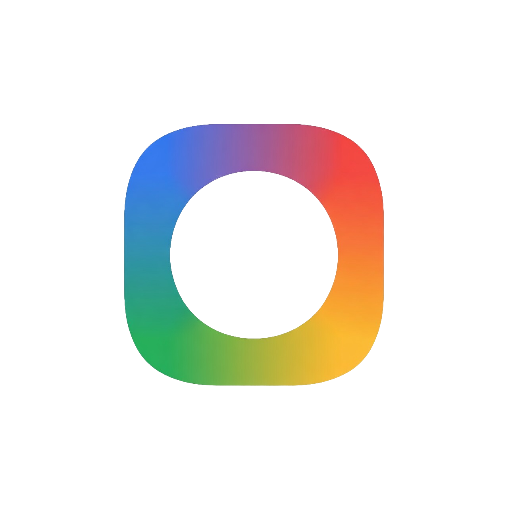

<!-- ---------- Header ---------- -->

  
  <h1>CTS Lite</h1>
  <h3>Fork of AKS-Lab's CircleToSearch, without accessibility permission</h3>

A fork of [CircleToSearch](https://github.com/AKS-Labs/CircleToSearch) by AKS-Labs.

CTS Lite removes the Accessibility Service dependency from the original app,
replacing it with Android's native VoiceInteraction API. This means the app
works without Accessibility permission and is fully compatible with banking
and financial apps. This app only requires internet permission.

## How It Works
Set CTS Lite as your Default Assistant, then long-press your home button
or edge-swipe up to search anything visible on your screen across Google
Lens, Bing, Yandex, and TinEye.

## Changes
Mostly removing the Accessibility permission and having the app capture a
screenshot that gets shared with the Digital Assistant, and then gets cropped
and searched like the original Circle To Search.

See [CHANGELOG.md](CHANGELOG.md) for a full list of changes between the original
CircleToSearch and CTS Lite 1.0.0.

## License
GPL-3.0 — see [LICENSE](LICENSE) for details.  
Original work Copyright (C) 2025 AKS-Labs.  
Modifications Copyright (C) 2026 Zawyer1.